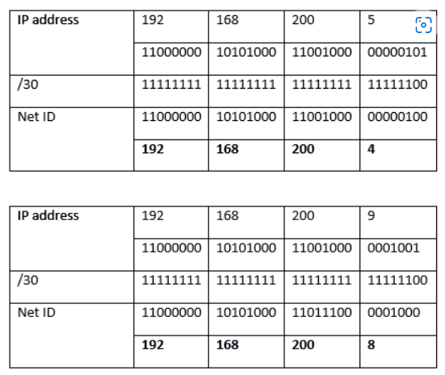

# IP subnetting

Lesson 4 of 9 

**At the core of the lesson, you will learn how to:**

- Describe the purpose of IP subnetting
- Use the Classless Inter-Domain Routing (CIDR) notation to specify subnet address ranges

### What is a subnet?

A subnet is *network inside of a network*. Subnetting is process of creating smaller networks by *dividing a large block of addresses* into several contiguous subdivisions. Subnets become useful when you must manage multiple networks. Organizations with multiple office locations can create individual subnets for their multiple locations. A coffee shop might manage a private network for their business operations and a public network for their patrons. Some important aspects of a subnet include these points:  

- A subnet *creates multiple logical networks* with different ranges of IP addresses. As an example, an organization could separate their networks. They could have an operational network and another network for machinery and IoT devices.  

- *Classless Inter-Domain Routing (CIDR)* notation is used to specify subnet IP address ranges. This system provides a shorthand for describing how the size of a network.  

- Devices that are in the *same subnet can communicate with each other without using any routers*.  

- Networks with Class A, B, or C IP addresses can be subnetted.

### About IP address classes

An important aspect to understanding a network is understanding the record class that is associated with it. IP addresses are divided into classes *based on their size and the subnetting capabilities* of the network that they support. The potential for an organization to divide their network space is determined by the *class* of their IP addresses. Three of these classes are commonly used, and they provide a logical separation between the networks:

- **Class A**  (0.0.0.0–127.255.255.255): Meant to be used for extremely large networks, like networks that are built by internet service providers (ISPs).
  -  A Class A record provides for up to 126 networks, which can each support up to 16,777,214 addresses! 
  - It is rare to see a single organization own a Class A record, but it does happen. Examples include Apple, who owns the entire 17.XXX.XXX.XXX space; and the Massachusetts Institute of Technology (MIT), who owns the 18.XXX.XXX.XXX domain.
- **Class B** (128.0.0.0–191.255.255.255): Suitable for medium to large networks, for example, for enterprises and organizations. 
  - Class B records can  provide a capacity for up to 16, 384 networks,  accounting for approximately 65,000 addresses each.
- **Class C** (192.0.0.0–233.255.255.255): Suitable for small networks, such as a home network or a  small business network.
  - Class C records provide 2,097,150 networks that can each allow for up to 254 addresses.

> All networks—no matter what their size is—reserve some IP addresses for specific functions:

- **Unknown address** (0.0.0.0): This address can have different meanings, depending on context. It might be used to represent an unknown or unroutable request, or it might be used to represent any address on a server. It virtually never refers to an individual device because it is not generally an assignable address.
- **Loopback** (127.0.0.1): An address that returns a message back to its originating device. This address is used for testing and debugging purposes. It is also used to allow a specific configuration of inter-domain routing between network routers.
- **All devices – broadcast** (255.255.255.255): An address that represents all devices that are connected to the network. The broadcast address is reserved so that information can be sent to every device on a network. It reduces the routing workload that would be incurred by individually routing information to each address.

It is useful to think about IP address classes when you consider subnetting. The IP address class provides a limit to how many networks can be created in that IP space. A very large organization might have a Class B record that enables them to create up to 16,382 networks, which can each support approximately 65,000 addresses. By using subnets, a network administrator might use this IP address to manage hundreds of individual networks across multiple cities, buildings, floors, and even departments.

### Purpose of subnetting

Subnetting can be used to organize and optimize a network. For example, you can use subnets to:

- Isolate different parts of the network  

- Apply different levels of security to different parts of the network  

- Relieve congestion on the network

Consider the following example:

- A company has a network that connects two of its buildings, the Manufacturing building and the Warehouse building. The network was assigned the *IP address range of 145.8.x.x.* The company wants to create two separate subnets to provide a level of isolation between the devices in each building.

*A manufacturing building and a warehouse that are on different subnets in one network*

- The *subnet* for the Manufacturing building is *assigned a subset of the network's IP address range*—specifically, *145.8.1.x*.
-  Likewise, the Warehouse building is *assigned a different subset of the network's IP address range**,* which is *145.8.2.x*.
- A *subnet mask* defines which section of the address *identifies the network*, and which section *identifies the hosts*.
-  A *router* or *default gateway* is used by devices on one network to communicate with the devices in another network.

*Each subnet's IP address range is a distinct subset of the overall network's IP address range*

### Classless Inter-Domain Routing (CIDR) notation

The Classless Inter-Domain Routing (CIDR) format is *used to specify IP address ranges* when you create a network or a subnet.

CIDR format

The CIDR format specifies a block (which is known as a *CIDR block*) of IP addresses. This block is represented by using the format *x.x.x.x/n*, where:

- *x.x.x.x* is an *IP address*. Recall that an *IPv4 IP address is a 32-bit number* that is represented as *four numbers separated by dots (.)*. Thus, each *x* is an *8-bit number (a byte) that can have a value between 0–255*. The IP address is logically divided into a *network prefix* and a *host identifier*. The network prefix identifies the network, and the host identifier identifies the host within the network.
- */n* specifies the *length in bits* of the *network prefix portion of the IP address* (starting from the leftmost bit). For an IPv4 IP address, the value of *n* can be from 0–32. The larger the value of *n*, the smaller the range size becomes, which results in a smaller number of usable IP addresses.

Steps for *determining the network ID or prefix* in a CIDR block:

1. *Convert* the IP address to *binary*.

2. *Note* the *number of bits that are designated after the slash*, from left to right. *Set all other numbers to 0*.

3. *Convert* the resulting binary number *back to decimal*.

Example of how to determine the network ID from CIDR notation

**Additional information:** To help determine the address range of a CIDR address, you can use the online calculator at the [Online IP CIDR / VLSM Supernet Calculator](http://www.subnet-calculator.com/cidr.php) webpage.

Examples of CIDR block ranges

The table below provides examples of CIDR block ranges, their corresponding bit representation, and their resulting address range.

## Key takeaways

- IP subnetting enables you to *divide a single network into multiple logical subnetworks*.
- *Classless Inter-Domain Routing (CIDR) notation* is used to specify the IP address range of a subnet.
- A CIDR block uses the format *x.x.x.x/n*, where:
  - *x.x.x.x* is an *IP address*
  - */n* specifies the *length in bits* of the *network prefix portion of the IP address*
